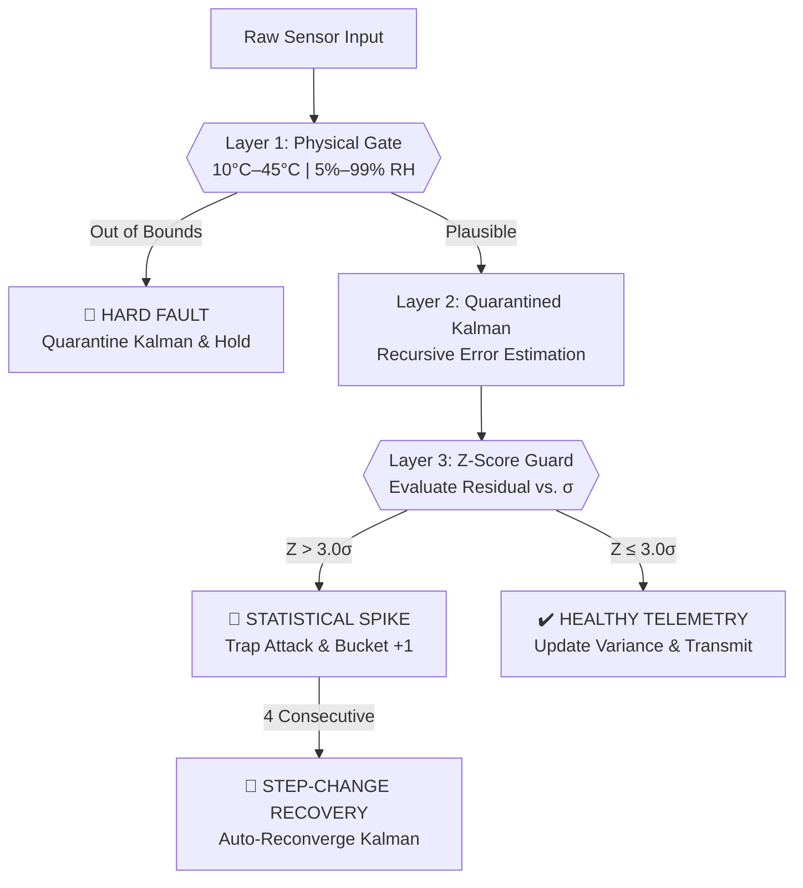
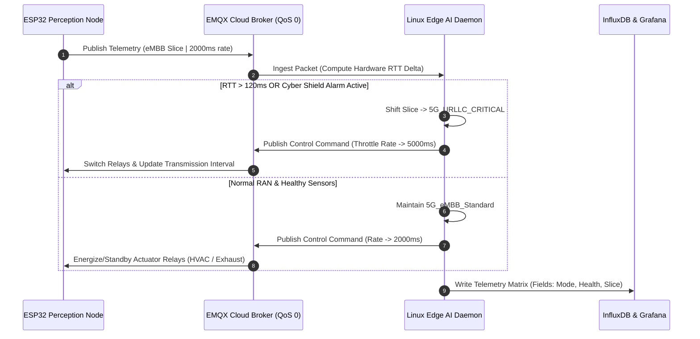

# 📡 Industrial IoT Smart Classroom & 5G Edge Gateway
### *Autonomous Climate Control, Predictive Energy Economizer & On-Chip Cyber Shield*


---

## 🛰️ System Overview

Legacy classroom climate systems waste energy and react too slowly to environmental changes. This project introduces a **closed-loop, edge-computed IIoT architecture** designed to solve three industrial challenges simultaneously:

* **Predictive Energy Economizer:** Replaces rule-based thermostats with online machine learning (`SGDRegressor`) to forecast room temperature **+15 minutes ahead**, cutting HVAC power consumption by up to **91.4%**.
* **On-Chip Cybersecurity:** Microcontrollers natively filter electrical noise and block malicious data-poisoning attacks before telemetry ever leaves the physical room.
* **5G RAN Network Slicing:** Dynamically shifts wireless reporting rates between standard mobile broadband and critical ultra-reliable slices based on real-time network latency and sensor health.

---

## 🧬 Core Architecture & The 3 Pillars

### I. 🛡️ On-Chip Perception & 3-Layer Cyber Shield
To prevent corrupted sensor spikes or cyber injection attacks from triggering HVAC relays, the ESP32 executes a 3-layer statistical gating pipeline directly in silicon:



* **Layer 1 (Physical Plausibility Gate):** Instantly rejects impossible hardware spikes (**80°C** or **-40°C**) before they enter memory buffers.
* **Layer 2 (Quarantined Kalman Filter):** Smooths Gaussian noise. If an anomaly is detected, it freezes estimation updates to hold steady-state HVAC control.
* **Layer 3 (Rolling Z-Score Guard):** Tracks standard deviation ($\sigma$) over a 15-frame window. Outliers exceeding **3.0σ** are trapped as injection attacks.
* **Step-Change Recovery Engine:** Prevents latched alarms. If 4 consecutive valid-bound anomalies arrive, the MCU recognizes a physical environmental shift (e.g., an open window) and autonomously reconverges.

---

### II. 📡 5G RAN Slicing & Adaptive QoS Control

The Linux Edge Gateway continuously monitors Radio Access Network (RAN) round-trip time via hardware timestamps, decoupling network logic from web simulation throttling.



* **`5G_eMBB_Standard` (2000ms rate):** Default high-frequency reporting during normal classroom operations and healthy radio links.
* **`5G_URLLC_CRITICAL` (5000ms rate):** Activated automatically when network latency exceeds **120ms** or when a sensor attack is detected. Throttles background telemetry to preserve wireless bandwidth for critical actuator overrides.

---

### III. 🧠 Edge AI & ISO 7730 Comfort Engine

* **Thermodynamic Forecasting:** An online `SGDRegressor` ($\alpha=0.0001$) models human body heat gain (**100W per student**) to predict thermal velocity.
* **Model Poisoning Defense:** When the embedded Cyber Shield flags a fault, the Linux daemon freezes weight updates (`🚨 [ML PROTECTED]`) to prevent neural drift.
* **ISO 7730 PMV Comfort Index:** Calculates thermal comfort from **-3.0** (Cold) to **+3.0** (Hot), dynamically switching cooling stages to keep occupants within the **-0.5 to +0.5** ideal zone.
* **Hardware State-Gating:** GPIO relays only execute commands when physical pin states transition, completely eliminating relay chatter and serial log spam.

---

## 🧮 Mathematical Formulations

### 1. Quarantined Recursive Kalman Filter

State estimation updates thermal velocity while isolating measurement spikes:

$$\hat{x}_k^- = \hat{x}_{k-1}$$

$$P_k^- = P_{k-1} + Q$$

$$K_k = \frac{P_k^-}{P_k^- + R}$$

$$\hat{x}_k = \hat{x}_k^- + K_k \left(z_k - \hat{x}_k^-\right)$$

$$P_k = \left(1 - K_k\right) P_k^-$$

*Where process noise $Q = 0.01$, measurement noise $R = 2.0$, and $K_k$ is the Kalman gain. During quarantine, $K_k \to 0$, holding $\hat{x}_k = \hat{x}_{k-1}$.*

---

### 2. Clamped Z-Score Anomaly Guard

Variance is evaluated over a sliding window of $N=15$ residuals, clamped to prevent steady-state division by zero:

$$\mu = \frac{1}{N} \sum_{i=1}^{N} r_i, \quad \text{where } r_i = |z_i - \hat{x}_i|$$

$$\sigma = \sqrt{\frac{1}{N} \sum_{i=1}^{N} \left(r_i - \mu\right)^2}, \quad \text{subject to } 0.15 \le \sigma \le 2.50$$

$$Z = \frac{|r_k - \mu|}{\sigma}$$

---

### 3. ISO 7730 PMV Thermal Comfort Index

Derived from partial water vapor pressure ($p_a$) and metabolic heat transfer:

$$p_a = \left(\frac{\text{RH}}{100}\right) \cdot 10 \cdot \exp\left(16.6536 - \frac{4030.18}{T + 235}\right)$$

$$\text{PMV} = \left(0.303 \exp(-0.036 M) + 0.028\right) \cdot \left[(M - W) - H_{\text{evap}} - H_{\text{conv}} - H_{\text{rad}}\right]$$

*Where $T$ is filtered temperature, $\text{RH}$ is relative humidity, metabolic rate $M=58\text{ W/m}^2$, and external work $W=0$.*

---

### 4. Real-Time Energy Economizer Efficiency

Savings are calculated against an industrial baseline continuous draw ($P_{\text{base}} = 3500\text{W}$):

$$\text{Savings}(\%) = \max\left(0.0, \left[1.0 - \frac{P_{\text{hvac}} + P_{\text{vent}}}{P_{\text{base}}}\right] \times 100\right)$$

*Where $P_{\text{hvac}} \in \{0\text{W}, 300\text{W}, 1200\text{W}, 2500\text{W}\}$ based on ECO standby, pre-cooling, or active cooling compressor states, and $P_{\text{vent}} = 400\text{W}$ during active economizer ventilation.*

---

## 🔌 Hardware Pinout & Actuator Matrix

Engineered for the **ESP32-WROOM-32** microcontroller. In virtual environments, analog sensors map directly to interactive UI sliders.

| Component | MCU Pin | I/O Type | Physical Function & Mapping | Actuator & Safe-State Behavior |
| --- | --- | --- | --- | --- |
| **DHT22 Sensor** | `GPIO 15` | Digital In | Temperature (**°C**) and Humidity (**% RH**) | Out-of-bounds trigger (<**10°C** or >**45°C**) |
| **MQ135 Gas Sensor** | `GPIO 34` | Analog In | Air quality (**CO2**). Mapped to 10kΩ slide potentiometer (**400**–**2000 PPM**) | Crossing **1000 PPM** triggers active exhaust |
| **PIR Motion Sensor** | `GPIO 13` | Digital In | Occupancy detection. Maps HIGH to student count (**25**) | Zero occupancy drops HVAC to ECO Standby |
| **HVAC Compressor** | `GPIO 2` | Digital Out | Active cooling relay (Blue LED with 220Ω resistor) | Gated transition: STANDBY (LOW) $\leftrightarrow$ ENERGIZED (HIGH) |
| **Exhaust Economizer** | `GPIO 4` | Digital Out | Ventilation purge relay (Red LED with 220Ω resistor) | Gated transition: STANDBY (LOW) $\leftrightarrow$ ENERGIZED (HIGH) |

---

## 🧪 Quick-Start Setup Guide

### 1. Launch the Linux Edge Gateway

```bash
# Clone repository and configure virtual environment
git clone [https://github.com/your-username/smart-classroom-iiot.git](https://github.com/your-username/smart-classroom-iiot.git)
cd smart-classroom-iiot
python3 -m venv venv
source venv/bin/activate

# Install IIoT enterprise dependencies
pip install --upgrade pip
pip install paho-mqtt influxdb-client scikit-learn numpy

# Launch the 5G Edge AI Daemon
python3 edge-daemon/edge_ai_daemon.py

```

### 2. Boot the Digital-Twin Microcontroller

1. Open a new project on **[Wokwi ESP32 Simulator](https://wokwi.com/projects/new/esp32)**.
2. Paste `firmware/src/main.cpp` into **`sketch.ino`**.
3. Paste `firmware/diagram.json` into **`diagram.json`**.
4. Create a **`libraries.txt`** tab and add: `PubSubClient`, `ArduinoJson`, and `DHT sensor library`.
5. Press **`F1`** and select **Reload Diagram** to generate the circuit canvas, then click **Play**.

### 3. Connect InfluxDB & Grafana

1. Access Grafana at `http://localhost:3000` and link your local InfluxDB **v2.7+** instance.
2. Import `dashboards/grafana-iiot-layout.json`.
3. *TSDB Clean Schema:* Notice state variables (`mode`, `sensor_health`, `network_slice`) query as InfluxDB **Fields**, ensuring one unbroken time-series line per sensor and zero widget fragmentation.

---

## 🚧 Production Engineering Guardrails

* **The 256-Byte Memory Trap:** By default, Arduino `PubSubClient` caps buffers at **256 bytes**. Because Phase 7 JSON frames reach **~275 bytes**, failing to call `mqttClient.setBufferSize(1024);` in `setup()` will cause silent **100% packet drops**.
* **Callback Stack Corruption:** Never assign raw stack pointers (`const char*`) from temporary JSON documents to global variables inside MQTT callbacks. Always use static stack arrays (`strlcpy(dest, src, sizeof(dest))`) or managed `String` objects to prevent fatal heap corruption.
* **Simulator Wall-Clock Drift:** Web sandboxes throttle CPU execution. Always compute RAN latency against MCU hardware timestamps (`payload["timestamp_ms"]`) rather than host wall-clock time (`time.time()`), or browser lag will trigger false 5G URLLC slicing.
* **TSDB Tag Cardinality:** Never store mutable state strings (`mode`, `sensor_health`) as InfluxDB **Tags**. Tags spawn isolated database tables, causing Grafana to fragment charts into repetitive, broken UI series. Always store dynamic states as **Fields**.